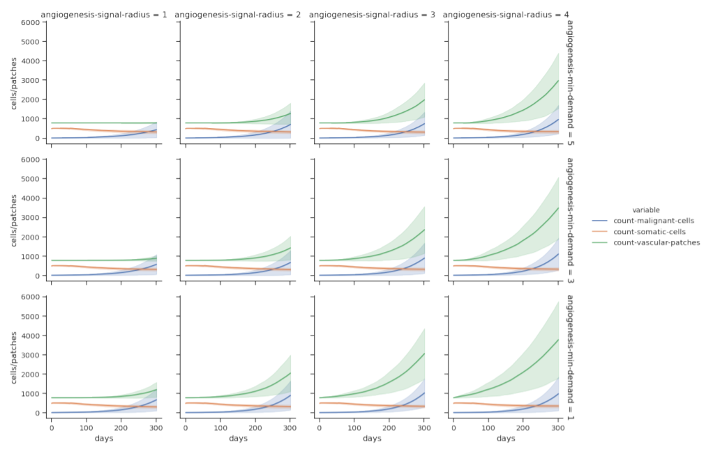

# In Silico Growth of Cancer Cells & Tumour Angiogensis

Assignment 2 of Computational Modelling and Simulation (COMP90083)

## Description

This is a simulation project using NetLOGO to explore the angiogenesis of cancer cell, with the results analyzed using Python-pandas and R.

## Members

- Nhan Kiet To
- Adam Thalhammer
- Will Walters

## Some sneekpeak pictures

0. Angiogenesis

1. The world/cell setup

2. Number vasular patches angiogenesis

3. Time series chart of cells infected, with different nutrition level

Read full report 👉 [here](doc/Report_Group18.pdf)

Install [NetLOGO](https://ccl.northwestern.edu/netlogo/) to run the experiment! 

It was a great pleasure working with my talented teammates Adam and Will!!! 🍻🥂📣🎉🎉🎉